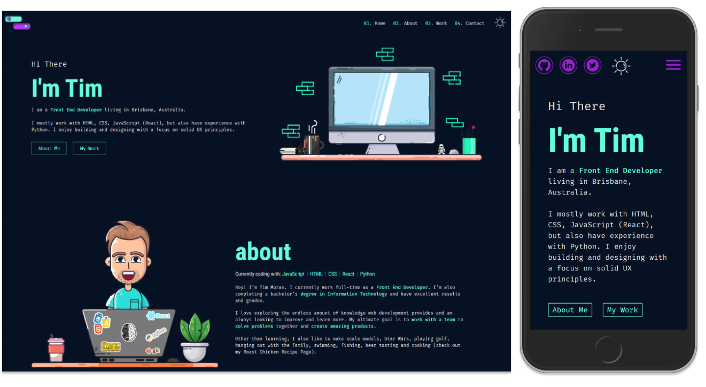

# tim-moran.com

 

Tim's personal website build with HTML, CSS and JavaScript.

**Note**: The website was built by me from scratch A big thanks to https://lukaszadam.com/illustrations for the free illustrations he provides on his website I really like the look and feel of theme.

## License

This project is open source and available under the [MIT License](LICENSE).
